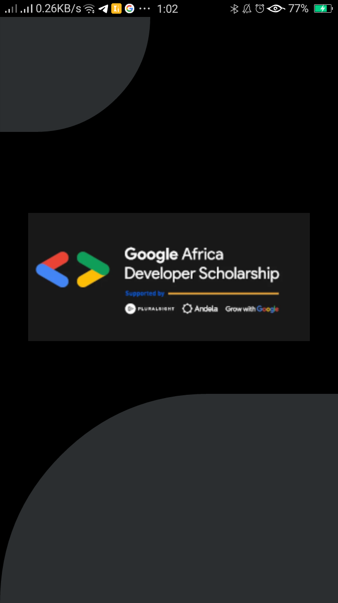
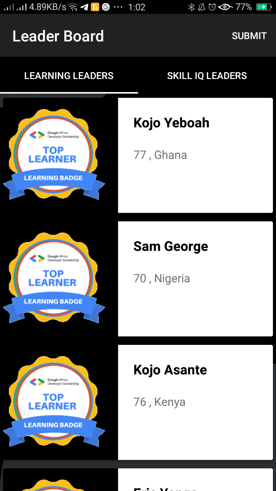
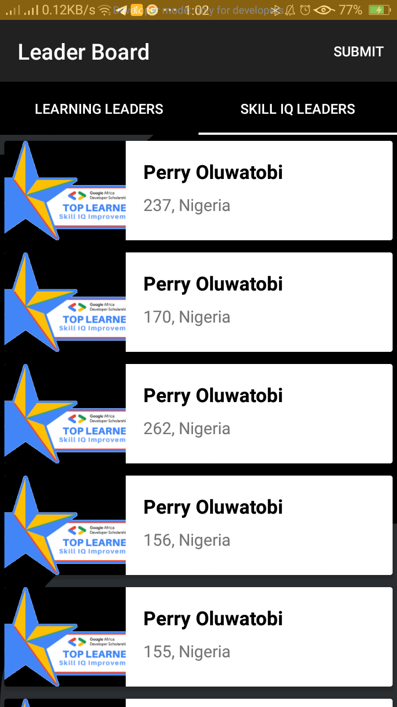
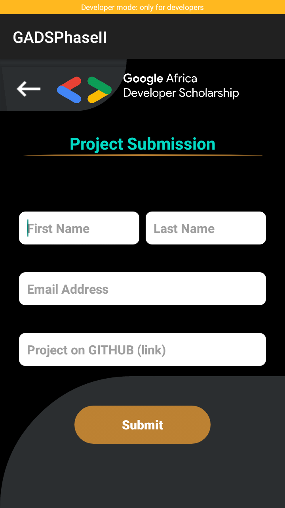
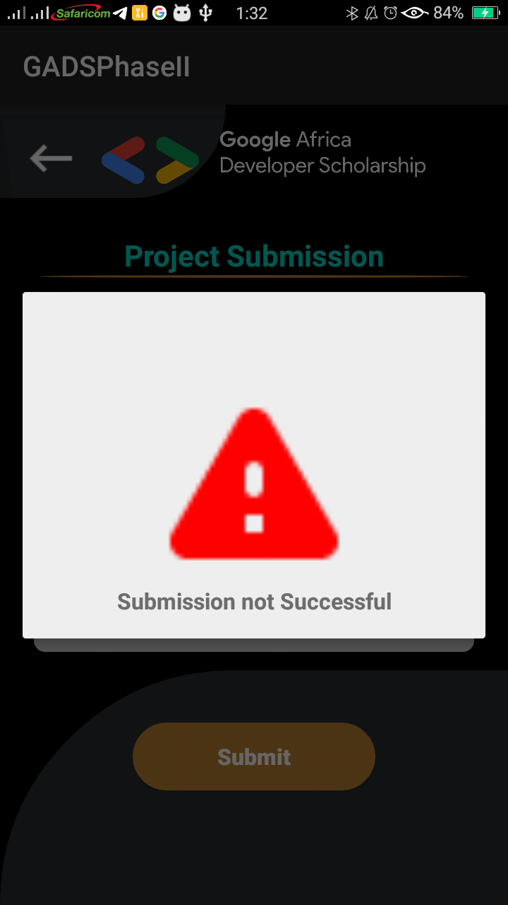
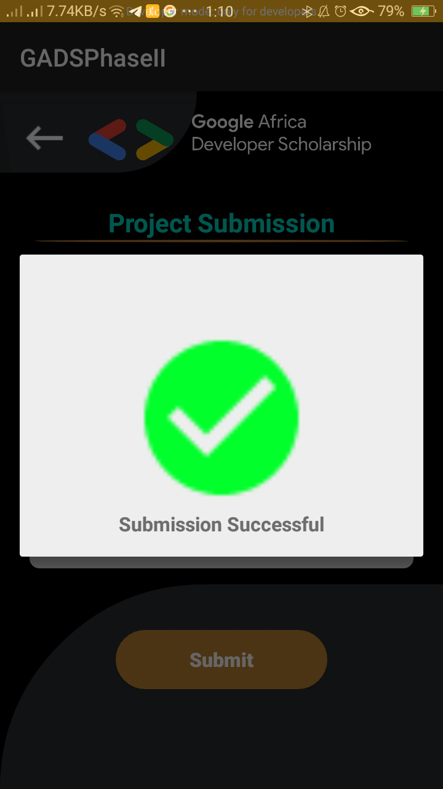
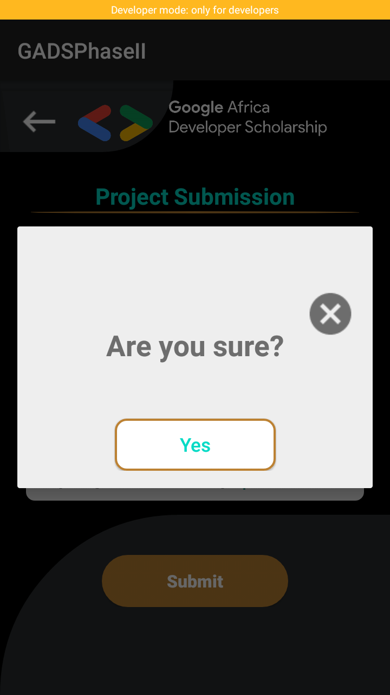

# GADS2020
#GADS Project SPONSORED BY ANDELA AND GOOGLE - In Progress.

This app consumes GADS 2020 API and displays a list of top 20 learners in Learning Leaders Category and Top 20 Leaders in the Skill IQ category.

# CONCEPTS COVERED IN THIS PROJECT

-Networking in android using Retrofit
-DI
-DAGGER
-VIEW PAGER
-Networking in android

# I have used the following components to set up the project

-view model to manage UI's data.

-Livedata to manage data in a lifecycle aware manner helping reduce memory leaks.

User Interface

### SPLASH SCREEN

### Top 20 Learners and top 20 skill IQ Leaders
       

### Project submission interface

### Network Error and Success Interface
            

### Are you sure dialog

